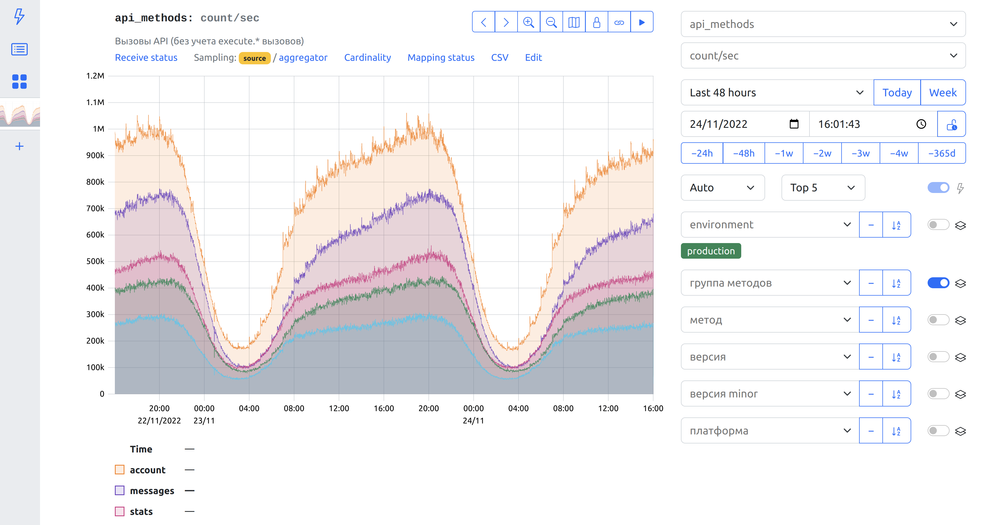
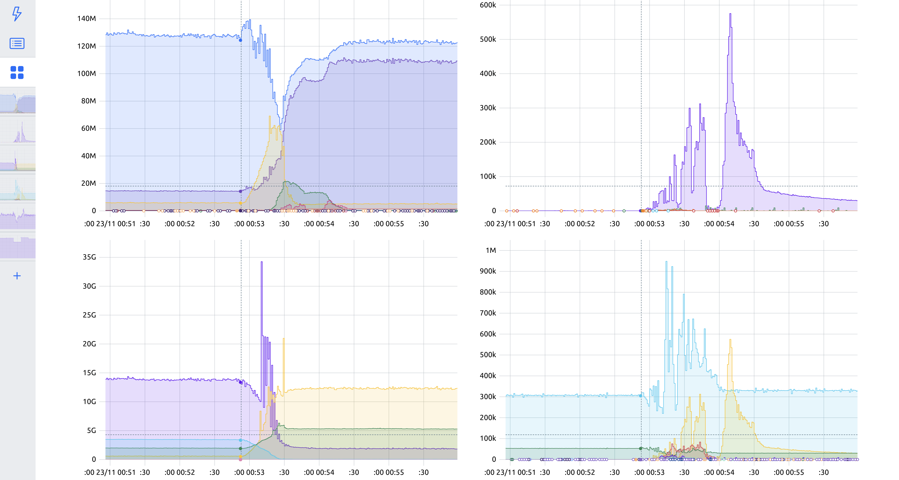

# StatsHouse

StatsHouse is a highly-available, scalable, multi-tenant monitoring system.

## Why would I use StatsHouse?

**StatsHouse is used in production at big scale**  
StatsHouse is the main monitoring system of [vk.com](https://vk.com). As of
December 2022, main StatsHouse cluster is receiving 650 million metrics
per second from 15000 servers and stores 4 years of data.

**StatsHouse provides high resolution, low latency data**  
With default metric resolution of 1 second and latency of 5 seconds,
StatsHouse makes it easy to observe things happening in great detail
immediately as they are happening.

**StatsHouse provides long-term metrics storage**  
StatsHouse automatically downsamples high-resolution data to 1 minute and 1
hour resolutions with automatic TTL. High-resolution data is stored for 2
days, minute-resolution data is stored for a month, and hour-resolution
data is stored indefinitely.

**StatsHouse is easy to operate**  
StatsHouse automatically works around network unavailability and individual
machine failure. Most StatsHouse components are quasi-stateless. Main
stateful component is a ClickHouse cluster which StatsHouse uses
internally as a primary data store.

**StatsHouse is almost impossible to overload**  
StatsHouse uses explicitly configured per-second budgets for network and
disk usage, and automatically samples metrics which use more than their
fair share of the budget.

**StatsHouse has a built-in UI**  
Built-in UI allow to interactively dig into metrics without using any query
language. It also has a simple dashboard system. For more advanced use
cases, StatsHouse provides a Grafana data source plugin as well.

## UI screenshots

## Documentation

- [Quick start guide](./docs/quickstart.md)
- [Internals](./docs/internals.ru.md) (in Russian)

## Clients

- [Go](https://github.com/VKCOM/statshouse-go)
- [PHP](https://github.com/VKCOM/statshouse-php)
- [C++](https://github.com/VKCOM/statshouse-cpp)
- [nginx](https://github.com/VKCOM/nginx-statshouse-module)

## License

StatsHouse is licensed under the [Mozilla Public License Version 2.0](./LICENSE). 
