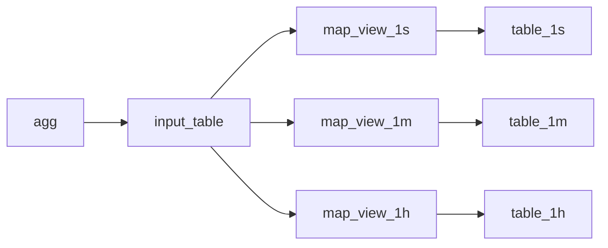
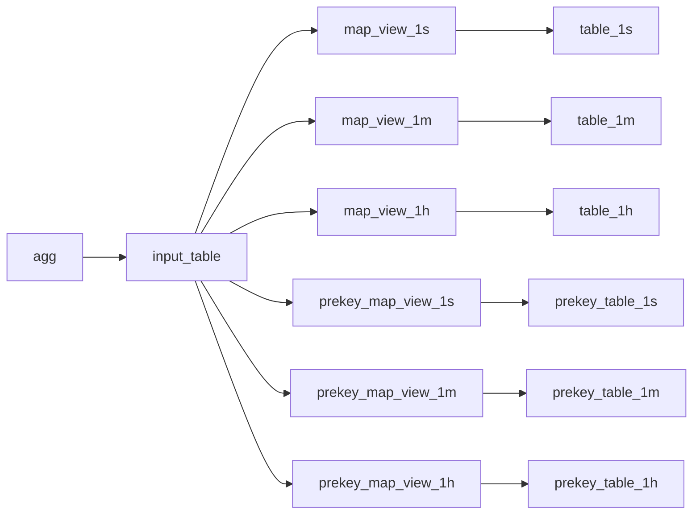

# New schema

- number of tags increased 16 -> 64
- tag types `Int32` -> `Int64` to support raw tags
- two raw `Int128` tags to support long ids or ipv6 addresses
- `flags` bitfield to indicate in which tables we want to write
- `raw_flags UInt64` column to indicate that tag is raw
	- idea here is to write all number tags as raw tags automatically, and remove raw tag option from UI altogether
- each tag followed by unmapped stag option, only one them should be set at a time
	- prekey is required to always be mapped
- `index_type UInt8` to merge basic and prekey tables
	- 0 - basic index
	- 2 - prekey index
- `PARTITION BY` increased from 6 to 12 hours
- `PRIMARY KEY` will be shortened to `index_type, metric, prekey, time` ordering will still be dependent on all tags

Stuff that is not part of this change
- separate `r0..r3` columns for raw tags(except for long ones)
	- instead we increase size of usual columns to 64 bits
	- also automatically guess when tag is raw and mark it with a bit in `raw_flags`
- separate host tag
	- I don't see any reason to have it, since we can configure any other tag as host
- payload for events it's not part of key and can be added anytime in a future

## Write dataflow

## Schemas
### input_table
1. `metric Int32`
2. `prekey Int64`
3. `flags UInt8`
4. `time DateTime`
5. `key0 Int64`
6. `skey0 String`
7. ...
8. `key63 Int64`
9. `skey63 String`
10. `raw_flags UInt64`
11. `host String`
12. `skey String`
13. `lkey0 Int128`
14. `lkey1 Int128`
15. Digest

`flags` - bitfield with 3 reserved bits
1. write to basic index
2. write to prekey index
3. write to seconds table
4. write to minutes table
5. write to hour table

`raw_flags`  - bitfield to indicate which tags are written as a raw tags

### map_view_1x and table_1x
1. `index_type UInt8`
2. `metric Int32`
3. `prekey Int64`
4. `time DateTime`
5. `key0 Int64`
6. `skey0 String`
7. ...
8. `key63 Int64`
9. `skey63 String`
10. `raw_flags UInt64`
11. `skey String`
12. `lkey0 Int128`
13. `lkey1 Int128`
14. Digest

## Automatic raw tags
Problem: raw tags are confusing for users and has to be set up in advance. Changing tag  raw flag breaks all existing tags.

Idea is to detect that tag value in an allowed range: `[-2^63, 2^63-1]`  and automatically save it as a raw tag. To distinguish mapped tags from raw tags we add `raw_flags` field. 
All existing raw tags will be simply copied into new ones.

Only issue here is that some people would want to write `UInt64` values  `[0, 2^64-1]`  as raw tags. For them add additional flag in metadata that will signify that numbers over `2^63` should be treated as raw tags instead of strings. If this flag is set it's up to the user to ensure that all values send into agent are positive.

# Old schema

## Write dataflow

## Schemas

### input_table
1. `metric Int32`
2. `prekey Int32`
3. `prekey_set UInt8`
4. `time DateTime`
5. `key0 Int32`
6. ...
7. `key15 Int32`
8. `skey String`
9. Digest

`prekey` is a value of one of the tags or 0
`prekey_set` is the enum describing where to write
- 0 write only to basic table
- 1 write to both basic and prekey tables
- 2 write only to prekey table

### map_view_1x and table_1x
1. `metric Int32`
2. `time DateTime`
3. `key0 Int32`
4. ...
5. `key15 Int32`
6. `skey String`
7. Digest

### prekey_map_view_1x and prekey_table_1x
1. `metric Int32`
2. `prekey Int32`
3. `time DateTime`
4. `key0 Int32`
5. ...
6. `key15 Int32`
7. `skey String`
8. Digest

