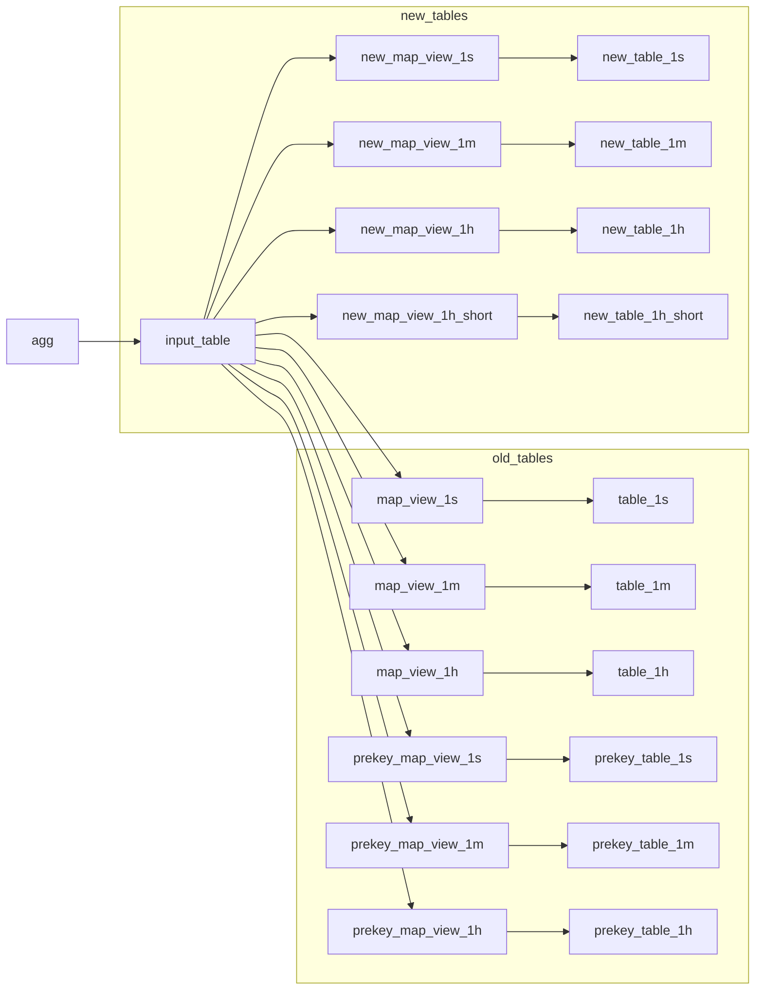
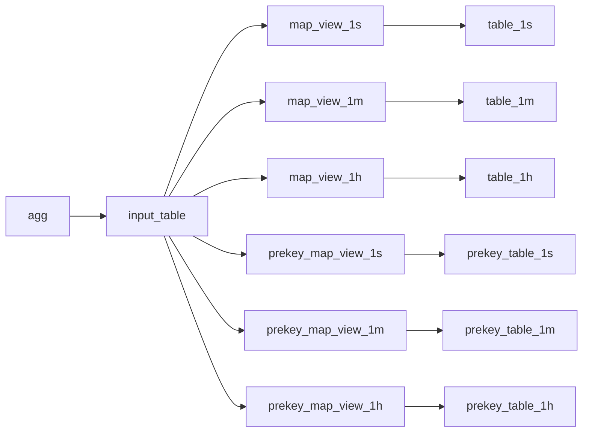

# New schema

- number of tags increased 16 -> 48
- `flags` bitfield to indicate in which tables we want to write
	- new + old table or just new table (for migration to a new pipeline)
	- prekey, basic or both tables
	- hour table with TTL or default hour table
		- to store short lived metrics that live only for 1mo (like pod telemetry)
- each tag followed by unmapped stag option, only one them should be set at a time
- add `pre_stag` to store unmapped prekeys
- `index_type UInt8` to merge basic and `pre_tag` tables into a single one
	- 0 - basic index
	- 2 - `pre_tag` index
- `PARTITION BY` increased from 6 to 24 hours
- `PRIMARY KEY` will be shortened to `index_type, metric, prekey, pre_stag, time` and first 8 tags
- `max_host`, `min_host` will become `AggregateFunction(argMax, String, Float32)` because we want to store location, and can't always map host
- add `max_counter_host` we can do it later
- `max_host_legacy`, `min_host_legacy` in the input table to write aggregates into original table, they will be removed after trasition period
- in `*_host` columns string will be binary data, where first byte signifies what is written in it, at start we will use 5 bytes, first is always 0, 4 other are Int32 tag

## Write dataflow

## Schemas
### input_table
1. `index_type UInt8`
2. `metric Int32`
3. `pre_tag Int32`
4. `pre_stag String`
5. `time DateTime`
6. `tag0 Int64`
7. `stag0 String`
8. ...
9. `tag47 Int64`
10. `stag47 String`
11. `min_host AggregateFunction(argMax, String, Float32)`
12. `max_host AggregateFunction(argMax, String, Float32)`
13. `max_count_host AggregateFunction(argMax, String, Float32)`
14. `min_host_legacy AggregateFunction(argMin, Int32, Float32)`
15. `max_host_legacy AggregateFunction(argMax, Int32, Float32)`
16. ... (rest of digest)

### table_1x
1. `index_type UInt8`
2. `metric Int32`
3. `pre_tag Int32`
4. `pre_stag String`
5. `time DateTime`
6. `tag0 Int64`
7. `stag0 String`
8. ...
9. `tag47 Int64`
10. `stag47 String`
11. `min_host AggregateFunction(argMax, String, Float32)`
12. `max_host AggregateFunction(argMax, String, Float32)`
13. `max_count_host AggregateFunction(argMax, String, Float32)`
14. ... (rest of digest)

`index_type`
- 0 - main index (pre_tag is empty)
- 1 - pre_tag index

# Old schema

## Write dataflow

## Schemas

### input_table
1. `metric Int32`
2. `prekey Int32`
3. `prekey_set UInt8`
4. `time DateTime`
5. `key0 Int32`
6. ...
7. `key15 Int32`
8. `skey String`
9. Digest

`prekey` is a value of one of the tags or 0
`prekey_set` is the enum describing where to write
- 0 write only to basic table
- 1 write to both basic and prekey tables
- 2 write only to prekey table

### map_view_1x and table_1x
1. `metric Int32`
2. `time DateTime`
3. `key0 Int32`
4. ...
5. `key15 Int32`
6. `skey String`
7. Digest

### prekey_map_view_1x and prekey_table_1x
1. `metric Int32`
2. `prekey Int32`
3. `time DateTime`
4. `key0 Int32`
5. ...
6. `key15 Int32`
7. `skey String`
8. Digest
