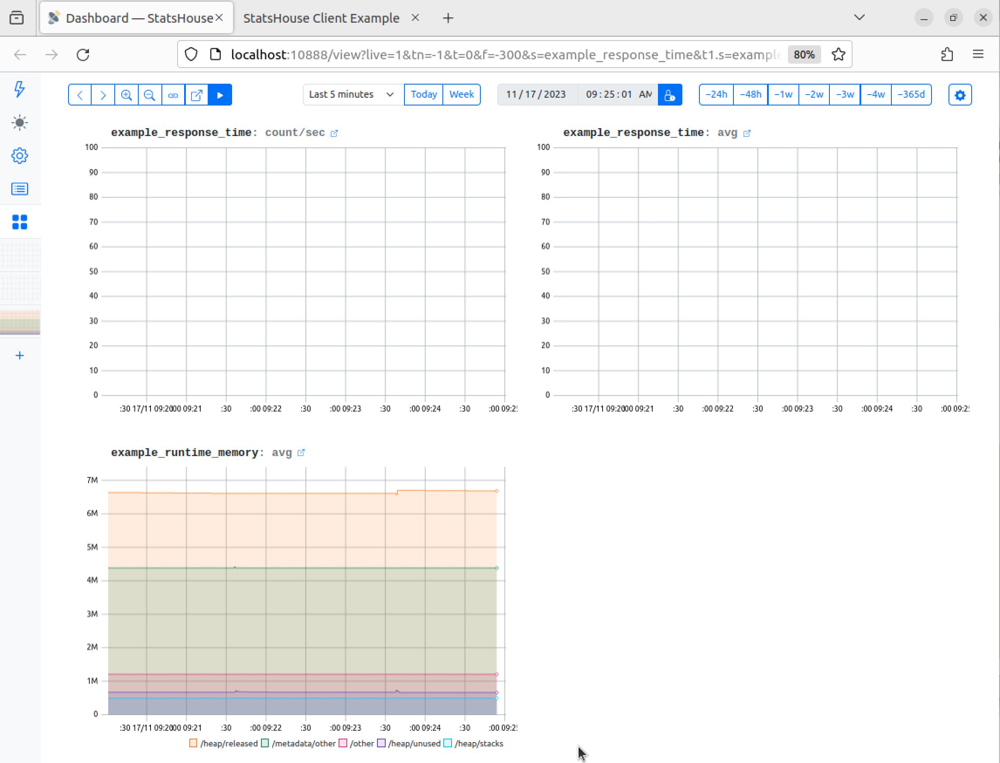

# Quick demo

See how StatsHouse works in 5 minutes:

<!-- TOC -->
* [Run StatsHouse (via Docker)](#run-statshouse-via-docker)
* [Send metrics from a Go web server](#send-metrics-from-a-go-web-server)
* [View metrics on a dashboard](#view-metrics-on-a-dashboard)
<!-- TOC -->

:::warning
You should have [Docker](https://docs.docker.com/get-docker/) and [Go](https://go.dev/doc/install) installed.
:::

## Run StatsHouse (via Docker)

1. Clone the StatsHouse repository:
```shell
git clone https://github.com/VKCOM/statshouse
```

2. Go to the StatsHouse directory:
```shell
cd statshouse
```

3. Run a local StatsHouse instance—the UI opens once it is ready:
```shell
./localrun.sh
```

## Send metrics from a Go web server

From the StatsHouse directory, run a [simple instrumented Go
web server](https://github.com/VKCOM/statshouse/blob/master/cmd/statshouse-example/statshouse-example.go)—it will send metrics to your StatsHouse instance:
```shell
go run ./cmd/statshouse-example/statshouse-example.go
```

## View metrics on a dashboard

View the metrics in the StatsHouse dashboard at 
[localhost:10888](http://localhost:10888/view?live=1&f=-300&t=0&tn=-1&s=example_response_time&t1.s=example_response_time&t1.qw=avg&t2.s=example_runtime_memory&t2.qw=avg&t2.qb=key1).



:::info
To try out full StatsHouse features, get to know the [basic flow](basic-flow) and the [guides](category/guides).
:::


